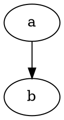

# Python Graphviz WASM Backend Plan

## Goal

Build a Python-installable Graphviz backend that renders DOT to SVG through a WebAssembly module, without requiring native Graphviz, Node.js, a browser, or a JavaScript runtime.

The backend should prioritize:

- Simple Python installation for end users.
- A reproducible build process for maintainers.
- A minimal default runtime using pure-Python `pywasm`, if performance is practical.
- A fast optional runtime using `wasmtime`.
- A small, stable Python API that downstream notebook/display libraries can call.

## Non-Goals

- Do not wrap the current JavaScript/Embind Graphviz package.
- Do not require users to install Graphviz through conda, pixi, Homebrew, apt, or system packages.
- Do not require users to install Emscripten, vcpkg, CMake, Zig, or other build tools at runtime.
- Do not support every Graphviz output format in the first version. Start with SVG.
- Do not support external image/file inputs in the first version unless they fall out naturally from WASI.

## Desired End-User Experience

Minimal pure-Python runtime:

```bash
pip install wasi-graphviz[pywasm]
```

```python
from wasi_graphviz import render

svg = render("digraph G { a -> b }", format="svg", engine="dot")
```

Optional faster runtime:

```bash
pip install wasi-graphviz[wasmtime]
```

```python
svg = render("digraph G { a -> b }", backend="wasmtime")
```

## Architecture

The project has three layers:

1. **Graphviz WASM artifact**
   - A single vendored `.wasm` file.
   - Built from Graphviz and required static libraries.
   - Exposes a small C ABI.
   - Targets WASI Preview 1 if possible.

2. **Python runtime backends**
   - `PywasmBackend`: minimal pure-Python backend using `pywasm`, if the artifact is compatible and performance is acceptable.
   - `WasmtimeBackend`: optional fast backend using `wasmtime`.

3. **Public Python API**
   - A small `render(...)` function.
   - Optional backend selection.
   - Clear errors when a backend is unavailable.

## Proposed C ABI

The WASM module should avoid C++/Embind/JS-facing APIs and expose plain C functions:

```c
char *graphviz_render(const char *dot, const char *format, const char *engine);
const char *graphviz_last_error(void);
const char *graphviz_version(void);
void graphviz_free(char *ptr);
```

Expected behavior:

- `graphviz_render` returns a malloc-owned UTF-8 string.
- The caller must release returned strings with `graphviz_free`.
- On failure, `graphviz_render` returns `NULL`.
- `graphviz_last_error` returns a borrowed UTF-8 error string.
- Inputs and outputs are null-terminated UTF-8.

The module must also expose enough allocation functions for Python to write input strings into WASM memory. Ideally:

```c
void *malloc(size_t size);
void free(void *ptr);
```

or explicit project-owned allocation helpers.

## Tooling With Pixi

Use `pixi` only for the maintainer/build environment. End users should not need pixi.

Initial `pixi.toml` tools:

```toml
[workspace]
name = "wasi-graphviz"
channels = ["conda-forge"]
platforms = ["osx-arm64", "osx-64", "linux-64"]

[tasks]
build-wasm = "python scripts/build_wasm.py"
validate-wasm = "wasm-objdump -x build/graphviz.wasm"
test = "pytest"

[dependencies]
python = ">=3.11"
zig = "*"
cmake = "*"
ninja = "*"
pkg-config = "*"
wabt = "*"
bison = ">=3.8.2,<4"
flex = ">=2.6.4,<3"
```

Potential additional build tools:

- `wasi-sdk`, as an alternative compiler if `zig` is unavailable or awkward on a platform.
- `binaryen`, if optimization or post-processing is needed.

Use **`zig`** as the primary compiler toolchain. It bundles `libc` and cross-compilation support, making it the most convenient driver for `wasm32-wasi`. The command shape is:

```bash
zig cc -target wasm32-wasi
```

`wasi-sdk` is a valid fallback if `zig` cannot link the full Graphviz library stack.

Python dev dependencies live in `pyproject.toml`:

```toml
[project.optional-dependencies]
pywasm = ["pywasm"]
wasmtime = ["wasmtime"]
all = ["pywasm", "wasmtime"]
test = ["pytest", "ruff"]
```

## Step 1: Prove Pywasm Compatibility With a Tiny Module

Before touching Graphviz, create a tiny WASM module that exercises the same memory model the final backend will use.

Example exports:

```c
char *echo(const char *input);
void graphviz_free(char *ptr);
```

Build it to `wasm32-wasi` and verify:

- It can be inspected or converted with `wabt` tools such as `wasm-objdump` or `wasm2wat`.
- It imports only WASI Preview 1 functions, or no imports.
- `pywasm` can instantiate it.
- Python can:
  - allocate/write a UTF-8 input string,
  - call the exported function,
  - read a returned UTF-8 string,
  - free returned memory.

Success criteria:

```bash
pixi run build-wasm
uv run --with pywasm python scripts/spike_pywasm_echo.py
```

Expected output:

```text
hello
```

If this fails, solve the pure-Python runtime problem before adding Graphviz complexity.

## Step 2: Prove Wasmtime Compatibility With the Same Tiny Module

Use the exact same tiny WASM module and call it through `wasmtime`.

Success criteria:

```bash
uv run --with wasmtime python scripts/spike_wasmtime_echo.py
```

Expected output:

```text
hello
```

This confirms that both planned Python backends can share the same ABI.

## Step 3: Build or Obtain Graphviz Static Libraries for WASI

This is the highest-risk step.

Needed artifacts:

- Graphviz headers.
- Static libraries for the WASI target:
  - `libgvc.a`
  - `libcgraph.a`
  - `libcdt.a`
  - layout libraries such as `libdotgen.a`, `libneatogen.a`, `libfdpgen.a`, `libsfdpgen.a`
  - plugin libraries such as `libgvplugin_core.a`, `libgvplugin_dot_layout.a`, `libgvplugin_neato_layout.a`
  - required dependencies such as expat

Rules:

- Do not reuse Emscripten-built `.a` files for a WASI target.
- Do not depend on conda/pixi-built native Graphviz at runtime.
- Build outputs must be target-compatible with the final WASM module.

First attempt:

- Use `zig cc -target wasm32-wasi` as the compiler/sysroot.
- Build only the minimum Graphviz subset needed for SVG output and core layout engines.
- Disable optional renderers and features not needed for SVG.

Fallback:

- Use `wasi-sdk` if `zig` cannot link the full Graphviz library stack.

Success criteria:

- Static libraries for `wasm32-wasi` exist under a deterministic build directory.
- No Emscripten-specific objects are linked.

## Maintainable Graphviz/WASI Release Strategy

Graphviz source must be treated as immutable input. The project should support new Graphviz releases by changing our build scripts, flags, compatibility headers, and tests, not by hand-editing downloaded Graphviz files.

The release pipeline should be:

```text
scripts/build_wasm.py
  -> download/extract Graphviz version X.Y.Z into build/src/
  -> apply deterministic build overlays or preparation steps
  -> configure CMake with native/wasm32-wasi-toolchain.cmake
  -> build static Graphviz libraries for wasm32-wasi
  -> link native/main.c plus Graphviz libraries into build/graphviz.wasm
  -> validate imports, exports, and wasm features
  -> copy the artifact to src/wasi_graphviz/assets/graphviz.wasm
```

Allowed compatibility layers, in preferred order:

1. **CMake options**
   Disable features that are not needed for the first SVG-focused target, especially optional renderers, CLI tools, tests, shared libraries, dynamic loading, and C++ APIs.

   ```bash
   -DBUILD_SHARED_LIBS=OFF
   -Dwith_cxx_api=OFF
   -Dwith_cxx_tests=OFF
   -Dwith_ipsepcola=OFF
   ```

2. **Toolchain flags**
   Put WASI libc feature switches and cross-compilation behavior in `native/wasm32-wasi-toolchain.cmake`.

   ```cmake
   -D_WASI_EMULATED_SIGNAL
   -D_WASI_EMULATED_PROCESS_CLOCKS
   -include native/wasi_stubs.h
   ```

3. **Injected compatibility headers**
   Use `native/wasi_stubs.h` for missing POSIX functions only when the semantics are harmless for the rendering path. Examples include no-op file-lock helpers used around logging.

4. **Automated preparation scripts**
   If Graphviz build files require adjustment, implement it in an idempotent script such as `scripts/prepare_graphviz_wasi.py`. The script should use explicit, version-tolerant pattern checks, document why each transform exists, and fail loudly when expected patterns are not present.

Manual edits to files under `build/src/graphviz-X.Y.Z/` are not allowed. If a future Graphviz release fails, fix it by adding or changing one of the compatibility layers above.

The version upgrade workflow should be:

```bash
python scripts/build_wasm.py --graphviz-version 15.0.0
uv run pytest
```

When the build fails, triage in this order:

- If the feature is unnecessary, disable it with a CMake option.
- If WASI libc already has an emulation mode, add the compiler/linker flag in the toolchain.
- If a missing function is safe to stub for the render path, add it to `native/wasi_stubs.h`.
- If Graphviz CMake logic is incompatible with cross-compilation, update the automated preparation script.
- If the failure affects the core render path and cannot be stubbed safely, reconsider the supported feature set before patching.

Every produced `graphviz.wasm` must pass validation gates before being vendored:

- `wabt` can inspect/convert the module, for example with `wasm-objdump` and `wasm2wat`.
- Imports are limited to intentional `wasi_snapshot_preview1.*` functions.
- No Emscripten, Embind, JavaScript glue, thread, dynamic loading, or legacy exception imports are present.
- Exports include `memory`, allocation helpers, `graphviz_render`, `graphviz_free`, `graphviz_last_error`, and `graphviz_version`.
- `pywasm` can instantiate the module with `pywasm.wasi.Preview1`.
- A simple DOT graph renders to SVG through the `pywasm` backend.
- The same graph renders through the optional `wasmtime` backend.

The first supported Graphviz build should target the smallest useful surface:

```text
DOT input -> Graphviz layout -> SVG output
```

Additional engines, output formats, file inputs, images, and plugins should be added only after the minimal pywasm-first path is stable.

## Step 4: Write the Plain C Graphviz Wrapper

Create a standalone wrapper, for example:

```text
native/main.c
```

The wrapper should:

- Include Graphviz headers directly.
- Preload required Graphviz plugins with `lt_preloaded_symbols`.
- Call:
  - `gvContextPlugins`
  - `agmemread`
  - `gvLayout`
  - `gvRenderData`
  - `gvFreeRenderData`
  - `gvFreeLayout`
  - `agclose`
  - `gvFinalize`
  - `gvFreeContext`
- Export only the planned C ABI.
- Capture Graphviz errors in a process-local error buffer.

Do not include:

- `emscripten.h`
- `emscripten/bind.h`
- `EM_ASM`
- Embind classes
- JavaScript-specific filesystem helpers

## Step 5: Link `graphviz.wasm`

Create a build script:

```text
scripts/build_wasm.py
```

Responsibilities:

- Locate Graphviz headers and target static libraries.
- Compile the wrapper for `wasm32-wasi`.
- Link all required libraries into one `.wasm`.
- Export only the required symbols.
- Write output to:

```text
build/graphviz.wasm
```

The build script may also copy the artifact into the Python package for distribution:

```text
src/wasi_graphviz/assets/graphviz.wasm
```

Validation gates:

```bash
wasm-objdump -x build/graphviz.wasm
wasm2wat build/graphviz.wasm >/dev/null
```

The module should not require:

- legacy wasm exceptions,
- Emscripten imports,
- Embind exports,
- JavaScript runtime helpers.

The module may import:

- `wasi_snapshot_preview1` functions, if required.

## Step 6: Implement the Pywasm Backend First

`pywasm` is the minimal dependency path and the strictest backend from a portability perspective. If the module works there, the ABI is likely simple enough.

Constraints:

- Works on Python 3.11 or newer.
- Performance may be slow.

Implementation tasks:

- Load the `.wasm` file.
- Instantiate it with `pywasm.wasi.Preview1` (built-in WASI Preview 1 support).
- Implement memory helpers:
  - write UTF-8 null-terminated strings,
  - read UTF-8 null-terminated strings,
  - release returned memory.
- Call `graphviz_render`.
- Raise a Python exception using `graphviz_last_error` on failure.

Success criteria:

```bash
uv run --with pywasm python -m pytest tests/test_pywasm_backend.py
```

The first test should render:



and assert:

- result starts with XML or `<svg`,
- result contains `<svg`,
- result contains node labels or expected SVG structure.

## Step 7: Implement the Wasmtime Backend

After the Pywasm compatibility path is known, implement the optional fast backend.

Implementation tasks:

- Load the same `.wasm`.
- Configure WASI using `wasmtime.WasiConfig` if the module imports WASI.
- Instantiate the module.
- Reuse the same memory and C string helpers.
- Call the same C ABI functions.

Success criteria:

```bash
uv run --with wasmtime python -m pytest tests/test_wasmtime_backend.py
```

The result should match the Pywasm backend semantically, not byte-for-byte.

## Step 8: Public Python API

Expose a small API:

```python
def render(
    dot: str,
    *,
    format: str = "svg",
    engine: str = "dot",
    backend: str = "auto",
) -> bytes:
    ...
```

Backend selection:

- `backend="auto"`:
  - prefer `pywasm` if installed and compatible,
  - fall back to `wasmtime` if available,
  - otherwise raise an actionable error.
- `backend="pywasm"`:
  - require `pywasm`.
- `backend="wasmtime"`:
  - require `wasmtime`.

Error messages should explain exactly which optional dependency is missing.

## Step 9: Packaging

Package layout:

```text
src/
  wasi_graphviz/
    __init__.py
    _constants.py
    _api.py
    _backend_wasmtime.py
    _backend_pywasm.py
    _memory.py
    backends/
      __init__.py
    assets/
      graphviz.wasm
```

`pyproject.toml` should include the `.wasm` file as package data.

Optional dependencies:

```toml
[project.optional-dependencies]
pywasm = ["pywasm"]
wasmtime = ["wasmtime"]
all = ["wasmtime", "pywasm"]
test = ["pytest", "ruff"]
```

End users should never need the build dependencies unless they are rebuilding the vendored WASM artifact.

## Step 10: Test Matrix

Minimum tests:

- C ABI memory round trip with tiny module.
- `wabt` inspection/conversion on `graphviz.wasm`.
- `PywasmBackend` renders a small SVG.
- `WasmtimeBackend` renders a small SVG.
- Invalid DOT returns a useful error.
- Missing optional dependency errors are clear.

Performance checks:

- Small graph under `pywasm`.
- Medium graph under `wasmtime`.
- Warn or document limits if `pywasm` is too slow for medium or large graphs.

## Go / No-Go Criteria

Proceed if:

- The Graphviz WASM artifact validates without legacy exceptions.
- The artifact can be loaded by `pywasm` using its built-in `Preview1` WASI support, or `pywasm` can be cleanly documented as unsupported.
- The artifact can be loaded by `wasmtime` as an optional accelerator.
- End users only need `pip install` plus optional Python runtime dependencies.

Stop or redesign if:

- Building Graphviz requires users to install pixi/conda/native Graphviz.
- The module requires Emscripten JS glue.
- The module requires legacy wasm exceptions.
- The module cannot expose a stable plain C ABI.
- `pywasm` is too slow even for tiny graphs and cannot serve as the minimal backend.

## Recommended Implementation Order

1. Create pixi build environment.
2. Build and test a tiny WASI C ABI module.
3. Verify tiny module with `pywasm`.
4. Verify tiny module with `wasmtime`.
5. Build Graphviz static libraries for WASI.
6. Link the plain C Graphviz wrapper.
7. Validate `graphviz.wasm`.
8. Implement `PywasmBackend`.
9. Implement `WasmtimeBackend`.
10. Add public API and package data.
11. Add tests and documentation.
